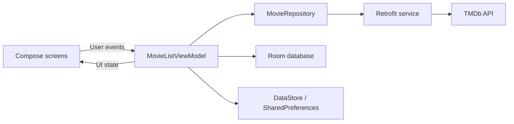

# CineTrack


CineTrack is a native Android movie discovery and tracking app built with Kotlin and Jetpack Compose. It combines live movie data from [The Movie Database (TMDb)](https://www.themoviedb.org/) with local persistence, allowing users to discover films, organize what they want to watch, record what they have seen, and receive recommendations based on their activity.

This project was created as a personal portfolio application to demonstrate modern Android UI development, REST API integration, local data persistence, reactive state management, and a layered MVVM-style architecture.

## Highlights

- Browse current popular movies from TMDb.
- Search the TMDb catalog with a debounced search experience.
- View movie posters, ratings, release years, overviews, and original languages.
- Save movies as favorites.
- Move movies between a watchlist and watched collection.
- Generate personalized recommendations from favorited and tracked movies.
- Sort full movie collections by title, rating, or release year.
- View profile statistics, including collection totals, average rating, most active year, and top-rated watched movies.
- Edit and persist a local profile name.
- Select system, light, or dark theme preferences.
- Handle loading, empty, and error states throughout the Compose UI.

## Tech Stack

| Area | Technology |
| --- | --- |
| Language | Kotlin |
| UI | Jetpack Compose, Material 3 |
| Architecture | MVVM-style presentation with repository and data layers |
| State & async work | Compose state, ViewModel, Kotlin Coroutines |
| Navigation | Navigation Compose |
| Networking | Retrofit, Gson |
| Remote data | TMDb REST API |
| Local database | Room |
| Preferences | DataStore Preferences, SharedPreferences |
| Image loading | Coil |
| Build system | Gradle Kotlin DSL, Version Catalog |
| Testing | JUnit, AndroidX Test, Espresso, Compose UI Test |

## Architecture

CineTrack separates UI concerns from data access. Composable screens render immutable UI models and forward user events to `MovieListViewModel`. The ViewModel coordinates remote requests through `MovieRepository`, persists tracked movies through Room, and exposes updated screen state back to Compose.



### Data flow

1. `MainActivity` creates the app navigation graph and observes the selected theme.
2. `MovieListViewModel` loads popular and locally tracked movies when the app starts.
3. `MovieRepository` requests popular, search, and recommendation results from TMDb.
4. Network DTOs are mapped into the app-level `Movie` model.
5. Favorite and watch-status changes are stored as `TrackedMovieEntity` records in Room.
6. The ViewModel rebuilds `MovieListUiState`, causing the relevant Compose screens to recompose.

Recommendations use up to four distinct movies from the user's favorites, watchlist, and watched collection as TMDb recommendation seeds. Existing tracked titles are removed from the results before the final list is displayed.

## Project Structure

```text
cinetrack-app/
├── app/
│   ├── build.gradle.kts                 # Android module configuration and dependencies
│   └── src/
│       ├── main/
│       │   ├── AndroidManifest.xml
│       │   ├── java/com/example/cinetrack/
│       │   │   ├── MainActivity.kt      # App entry point, navigation, and home screen
│       │   │   ├── MovieListViewModel.kt # Main state and user-action coordinator
│       │   │   ├── Movie*.kt            # Domain models, state, status, and sorting
│       │   │   ├── *Screen.kt           # Feature-level Compose screens
│       │   │   ├── data/
│       │   │   │   ├── local/           # Room database, DAO, entity, converters
│       │   │   │   └── preferences/     # DataStore theme preference
│       │   │   ├── network/
│       │   │   │   ├── model/           # TMDb response models
│       │   │   │   ├── mapper/          # DTO-to-domain mapping
│       │   │   │   ├── MovieApiClient.kt
│       │   │   │   └── MovieApiService.kt
│       │   │   ├── repository/          # Remote-data abstraction
│       │   │   └── ui/
│       │   │       ├── components/      # Reusable movie rows, grids, and states
│       │   │       ├── home/            # Home recommendation presentation
│       │   │       ├── screens/         # Profile and statistics UI
│       │   │       ├── settings/        # Theme settings and ViewModel
│       │   │       └── theme/           # Material color, shape, and type system
│       │   └── res/                      # Android resources and launcher assets
│       ├── test/                         # Local JVM tests
│       └── androidTest/                  # Instrumented Android tests
├── gradle/libs.versions.toml             # Central dependency versions
├── build.gradle.kts                      # Root build configuration
└── settings.gradle.kts                   # Gradle modules and repositories
```

### Key components

- `MainActivity.kt` defines the single-activity Compose application, its routes, and the home dashboard.
- `MovieListViewModel.kt` owns popular, search, favorite, watchlist, watched, recommendation, and profile state.
- `MovieRepository.kt` provides a focused boundary around TMDb requests.
- `MovieApiService.kt` declares the popular, search, and recommendation endpoints.
- `AppDatabase.kt` and `TrackedMovieDao.kt` manage locally tracked movies.
- `ThemeViewModel.kt` persists and exposes the selected appearance mode.
- `MovieSectionScreen.kt` provides reusable full-list rendering and sorting.

## Getting Started

### Prerequisites

- Android Studio with Android SDK 36 installed
- JDK 11 or newer
- A TMDb account and a TMDb API v3 key

### Installation

1. Clone the repository:

   ```bash
   git clone https://github.com/emirhanakdeniz/cinetrack-app.git
   cd cinetrack-app
   ```

2. Open the project in Android Studio and allow Gradle to sync.

3. Add your TMDb API key to the project-level `local.properties` file:

   ```properties
   TMDB_API_KEY=your_tmdb_api_key
   ```

   Keep the existing `sdk.dir` entry generated by Android Studio. `local.properties` is excluded from version control, so the key will not be committed.

4. Run the app on an Android emulator or physical device running Android 7.0 (API 24) or later.

You can also build from the command line:

```bash
# macOS / Linux
./gradlew assembleDebug

# Windows
gradlew.bat assembleDebug
```

> This client-side API-key setup is appropriate for a portfolio/demo application. A production app should proxy sensitive credentials through a secure backend.

## Testing

Run local unit tests:

```bash
./gradlew test
```

Run instrumented tests on a connected device or emulator:

```bash
./gradlew connectedAndroidTest
```

The repository currently contains the default local and instrumented test scaffolding. Expanding ViewModel, repository, Room, and Compose UI coverage is a planned improvement.

## What This Project Demonstrates

- Building a complete Android interface with declarative Compose components.
- Modeling loading, success, empty, and failure states explicitly.
- Coordinating asynchronous network and database work from a lifecycle-aware ViewModel.
- Mapping third-party API responses into application-owned domain models.
- Combining remote discovery with offline local collections.
- Persisting different kinds of state with Room, DataStore, and SharedPreferences.
- Creating reusable screens and components for multiple movie collections.
- Deriving user-facing recommendations and profile statistics from stored activity.

## Roadmap

- Add dependency injection with Hilt or Koin.
- Expand automated unit, database, and Compose UI tests.
- Add pagination and offline caching for discovery results.
- Move API access behind a secure backend for production use.
- Add screenshots and a short demo video.
- Improve accessibility and localization coverage.

## Data and Attribution

Movie metadata and artwork are provided by [TMDb](https://www.themoviedb.org/). This product uses the TMDb API but is not endorsed or certified by TMDb.

## Author

Developed by [Emirhan Akdeniz](https://github.com/emirhanakdeniz) as a personal Android portfolio project.
